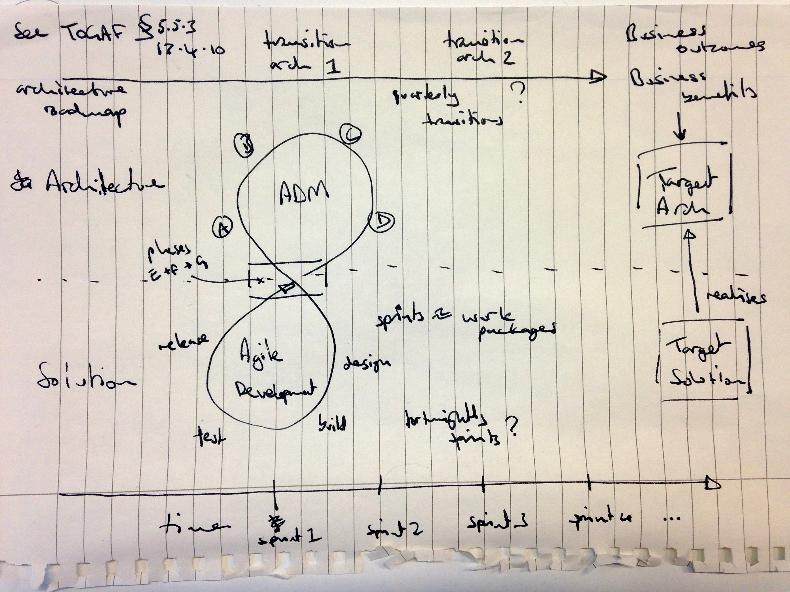

# Solution Architecture Method

<!--toc max5-->

## Introduction

This document describes the architecture lifecycle used by the Digital Public Services and Business Transformation division for delivering digital solutions. Overall this architecture method reflects the architecture development method as defined in [TOGAF](http://pubs.opengroup.org/architecture/togaf9-doc/arch/), however, the method is tailored so that it is a better fit for delivering digital services that meet the [Digital First Service Standard](http://resources.mygov.scot/standards/digital-first). Also, the method is focused on the delivery of one or more specific digital services and therefore is more appropriate to architecture practice at a capability level as opposed to a segment or enterprise level.

Some criteria from the Digital First Service Standard are of particular importance to this architecture method:

- **User Centered**
  Understand user needs. Research to develop a deep knowledge of who the service users are and what that means for the design of the service.
- **Continuous Feedback**
  Put a plan in place for ongoing user research and usability testing to continuously seek feedback and input from users to improve the service.
- **Cross-functional Team**
  Put in place a sustainable multidisciplinary team that can design, build and operate the service, led by a suitably skilled senior manager with decision-making responsibility.
- **Continuous Improvement**
  Build the service incrementally, releasing early and often, using the iterative and user-centred methods set out in the GDS service manual.
- **Operational Acceptance**
  Regularly test the end-to-end service in an environment identical to that of the live version, including on all common browsers and devices, and using dummy accounts and a representative sample of users.

In summary, the Digital First Service Standard expects delivery organisations to realise a truly adaptive delivery methodology that allows them to deliver continuously on behalf their users, Scottish citizens. Both the software development process and the architecture development method must be tailored to reflect this requirement and these two lifecycles must be correctly integrated so that they work in sympathy.

## Activities

It is very common within DPS&BT that the architecture "capability" to be realised is a citizen or business facing service. Therefore, by default, we re-use GDS [service design phases](https://www.gov.uk/service-manual/phases) as the basis for describing which activities will be undertaken and what deliverables will be produced over the course of the delivery process. In summary, GDS' service design phases are as follows:

- [Discovery](https://www.gov.uk/service-manual/phases/discovery.html)
  A short phase in which you start researching the needs of your service’s users, find out what you should be measuring, and explore technological or policy-related constraints.
- [Alpha](https://www.gov.uk/service-manual/phases/alpha.html)
  A short phase in which you prototype solutions for your users needs. You’ll be testing with a small group of users or stakeholders, and getting early feedback about the design of the service.
- [Beta](https://www.gov.uk/service-manual/phases/beta.html)
  You’re developing against the requirements of a live environment, understanding how to build and scale while meeting user needs. You’ll also be releasing a version to test in public.
- [Live](https://www.gov.uk/service-manual/phases/live.html)
  The work doesn’t stop once your service is live. You’ll be iteratively improving your service, reacting to new needs and demands, and meeting targets set during its development.
- [Retirement](https://www.gov.uk/service-manual/phases/retirement.html)
  Even the best services may eventually reach retirement. That should be treated with the same care as went into the building and maintaining of that service.

Both GDS and TOGAF define the concept of a series of phases – this can lead to confusion. When discussing this tailoring of the TOGAF architecure method when we refer to phases we will always use the GDS definition of a phase. In the following sections we will describe specific architecture activities and explain which GDS phase an activity takes place in. We will also briefly describe how specific TOGAF phases map to GDS phases.

### Discovery

From an architecture perspective, the primary purpose of the discovery phase includes three main actvities:

- improve your understanding of the problem that you are trying to solve;
- generate ideas as to how we might architect a solution that meets the needs of your users;
- agree with the business and the rest of the delivery team the architectural approach for delivery.

Improving your understanding of the problem always starts with understanding the [needs of your users](https://www.gov.uk/service-manual/user-research/start-by-learning-user-needs). This will means that you will be involved in user research activities such as definition of user personas and user journeys as well as stakeholder mapping. Complementary to an understanding of users it is important to establish an understanding of the business context within which delivery will take place. This should include clarification of the objectives of the project and the benefits that the business expects to deliver. Practices such as impact mapping, business scenarios and business value assessment may help with this. Finally, where an existing system exists, and is to be extended or replaced, documentation of the baseline architecture should be located (or, if missing, authored).

Under an agile approach we do not undertake the full architecture definition process (to produce an architecture description) prior to implementation. As for agile delivery in general, we acknowledge that at this early stage we know only a limited amount about the problem(s) we are trying to solve and acknowledge that the needs of both users and the business will change over the lifespan of the project. During discovery we are simply looking to begin to make some hypotheses about the sort of solution that we think will be suitable so that we can then test these during the alpha phase. This initial solution design will likely include activities such as wardley mapping and definition of a gaps, solutions, and dependencies matrix.

The discovery phase is the time to establish and agree how future architecture activities will proceed. This need not be a complex undertaking, particularly if an exsiting architecture practice is already established. The key elements that need to be agreed are:

- the overall architecture method;
- how architecture delivery will fit within the overall project delivery approach, including how the following processes will be undertaken:
    - risk management;
    - stakeholder management;
    - benefits management;
    - change management;
    - requirements management;
- how proportionate external governance will be applied;
- a set of architecture principles to underpin architecture definition;
- the tooling to be used;
- the architecture repository to be used along with associated document management practices for architecture deliverables.

Architecture outputs from this phase are:

- An architecure vision;
- A set of architecture principles;
- Documentation of the baseline architecture (if this did not exist).

### Evolution

In line with the [Manifesto for Agile Software Development](http://www.agilemanifesto.org) and the [Digital First Service Standard](http://resources.mygov.scot/standards/digital-first/) we value working software over comprehensive documentation. At first it may appear that this means that there is no time for solution architecture activities in our approach, as we're too busy delivering a product. In practice, however, this is not the case. Instead it means that we focus on creating architecture documentation that is proportionate to the risk and complexity of the solution and that is authored incremenetally over the lifecycle of the project.

Our architecture method focuses on an incremental design approach where the architectural understanding of the solution is evolved in parallel with actual delivery. Under this approach an architect creates the simplest possible design that will address the solution need; next they make iterative changes to the architecture both to address new needs that have been identified as well as to reflect any deviations that occurred as a result of solution development activity. Over time the architecture is continuously improved and continues to be an accurate reflection of the solution that has been built.

Taking this approach is not easy as it requires architects and engineers to resist their natural instinct to think in terms of abstractions. Instead the solution architecture should be generalised only when there is a specific need to do so, in order to avoid unnecessary re-work or duplication. An incremental design approach acknowledges a number of factors:

- we have the poorest understanding of the problem we are trying to solve at the beginning of a project, so significant 'up front' design work is most likely to be wrong;
- since business changes over time the problem that we're trying to solve will also change over the course of the project;
- feedback from users and the act of realising the solution will lead to 'breakthroughs' where our understanding of the problem (and therefore the required solution) will be rapidly accelerated.

There will always be some architecture decisions that it is impractical to defer until solution delivery. However, you should aim to keep these to a minimum and make them at the last responsible moment. For architecture activity that will take place once solution delivery has begun it will be necessary to prioritise which architecture design work should happen next. A 'risk based' approach is often most suitable. Under this model you will consider the architecture design decisions that are least well understood and most likely to have a sigificant impact on delivery if you get them wrong – focus on these first. Alternatively, a 'cost based' model may be appropriate. Under this model consider the architecture decisions that, if made in the future, will be most costly to implement – focus on these first. Of course you may need to balance a number of factors including cost and risk to come to your final decision.

#### Alpha

The alpha phase is the first opportunity for the team to explore solutions to some of the challenges identified during the discovery phase. The delivery team will begin to build and test prototypes and these will help the technical architect on the team to test some of the hypotheses that were established during the discovery phase. In particular, the architect can test any new technologies that have been proposed; confirm that the selected architectural style is suitable and that the high-level system architecture is sound; as well as explore challenges related to data such as volumetrics and transformation of legacy datasets.

Alongside the team's build and prototyping activities the alpha phase is the time for the architect to initiate the architectural activities that were agreed as a part of discovery. An outline architecture description document should be created and regularly updated as the architect learns from the alpha delivery. As the product manager begins to translate the user needs identified into user stories on a product backlog the architect should begin to plan architecture definition activities and draft an architecture roadmap.

A crucial activity for architects during the alpha is begin to work with the business to establish the warranty that is required for the system. By this we mean what are the system quality attributes that the live system must exhibit in order for it to be acceptable. It may seem early to consider this, however, the business often finds it very hard to articulate the qualities of the system and starting early provides plenty of time for the architect to educate business stakeholders so that they can make informed decisions. Secondly, realising system quality attribute late in the delivery process is both more difficult and more expensive. In some cases delivering such a requirement may require a fundamental re-engineering of the system. The architect should capture these requirements in a system quality specification and agree how the day to day delivery process will accomodate the realisation of these requirements.

Architecture outputs from this phase are:

- An outline architecture description;
- An outline architecture roadmap;
- A first draft of the system quality specification.

**Question**: *how do we document traceability from the proposed solution to the benefits to be delivered*?

#### Beta

Having proven or disproven your hypotheses for a solution that will 1. meet user needs, and 2. deliver the stated business outcomes, the beta phase is where the team embarks upon building the working service. As described in the [Digital First Service Standard](http://resources.mygov.scot/standards/digital-first), a cross-functional, co-located team will build the service incrementally, releasing early and often. The service will be incrementally improved based upon feedback from real users. It is crucial that architecture activities amplify rather than impede this delivery process.

For most substantive service deliveries we would expect that a full time technical architect will be required and that they will be fully embedded within the delivery team and contributing to all project practices and ceremonies. The architect will work with software engineers, infrastructure engineers and test engineers directing the technical aspects of the service delivery. While implementation work proceeds the technical architect will undertake architecture definition work, documenting this in an architecture description document.

Unlike traditional delivery approaches where system design is undertaken "up front", before a specification is handed over to the implementation team, our incremental approach also applies to system design and, therefore, the architecture definition process. The technical architect is expected to work in two modes:

- *predicitive*: the architect considers future requirements and defines an architecture that can accommodate them;
- *reflective*: the architect responds to feedback and learnings from the delivery process and adjusts the architecture to represent the real world challenges of building the service.

In *predictive* mode the architect will primarily work with the product owner to understand user needs and elaborate user stories. They will prioritise user stories on the backlog collaboratively, driven by the needs of real world users, but acknowledging technical risk and sequencing challenges as advised by the architect. The architect will use the prioritised product backlog as the basis for organising architecture design work. The architect is also available to support the engineers in translating from the architecture description (macro design) to system development (micro design) undertaken during each sprint.

In *reflective* mode the architect will work alonside delivery engineers to receive direct feedback on their success (or otherwise) in implementing the the architecture. This will typically include pair programming, creating spikes, reviewing test failures and attending retropsectives. The architect translates impediments that engineers experience into relevant changes to the architecture description.

Similar to incremental design for software development, there are a set of practices that can support incremental architecture definition. These will normally include regular, collaborative peer review of the target architecture description; re-use of patterns, blueprints, and other architecture building blocks; collective ownership; information radiators; and the application of architecture refactorings.

Architecture evaluation is an activity that allows the team to validate that the architecture chosen for a system (as documented in the architecture description) will meet the stated requirements. The architecture is one of the most significant factors in allowing or precluding realisation of a system's quality attributes. Therefore, it is important that the team knows as early as possible if the selected architecture is inadequate. Furthermore, changing an architecture becomes increasingly complex and expensive as implementation of the system proceeds. Lastly, as we have acknowledged above, requirements change over the lifetime of any significant project and the architecture must react to this. For these reasons under an agile approach architecture validation should be undertaken early and often. A normal cadence for architecture evaluation would be to review architectural changes every fortnight. We do not presecribe a specific approach to architecure evaluation but the activity should generate a series of actions to be addressed by the technical architect in the next cycle of architecture definition.

Many architecture methods include architecture compliance activities. However, definitions of architecture compliance vary considerably. Under our agile architecture approach we define architecture compliance as an activity that verifies the system architecture is consistent with the broader architecture landscape, realises active policy and strategy and meets organisational standards. Our compliance activity does not include verifying that the 'as built' system is consistent with the architecture description – this is the responsibility of the technical architect. Architecture compliance review is a formal activity that MUST occur before the beta phase is completed (and on a six-monthly basis for longer betas) and includes a thorough review of the architecture by a panel of independent experts. The compliance review results in an architecture report that is sent to the programme board, which records all non-compliances as well as compensating actions agreed with the team.

Finally, the technical architect will support the delivery team in realising the system quality specification. The technical architect will own the specification and facilitate the elaboration of non-functional aspects of user stories during sprint planning (or equivalent) to create non-functional acceptance criteria. When the delivery team marks stories as done the technical architect will support the product owner, performing non-functional acceptance to ensure that the agreed warranty for the system is delivered. The architect should also continue to check in with the business to make incremental changes to the system quality specification, in order to ensure that any relevant business changes are reflected.

Architecture outputs from this phase are:

- A complete architecture description;
- An up-to-date architecture roadmap;
- A complete system quality specification;
- Proportionate governance records relating to evaluation and compliance;
- A working system that is consistent with the architecture description and realises the warranty described in the system quality spec'.

#### Live

As explained in the [Digital First Service Standard](http://resources.mygov.scot/standards/digital-first), we expect that once a service is live it should continue to be improved based on feedback from users, analytics and further research. This means that system delivery will continue and, as such, the technical architect will continue to undertake the same range of activities they have in the beta. However, in some cases it may be that the technical architect is no longer required full time.

While the availability of a service means that operations activity has increased this should not be an impediment to regularly improving the service. The release engineering practices established by the team during beta should allow frequent, zero downtime releases. Incremental changes to the architecture should also be undertaken using patterns, practices and technologies that avoid disruption for end users.

### Retirement

If changes in circumstance mean that operation of a service will end then there will be a need for input the architecture team.

Although the service is no longer required, significant value has been accumulated in a range of assets. At a minimium the architect should archive the architecture repository, source code repository and any other information stores that contain relevant material. The technical architect will also direct the export of data from the old service. Where a replacement service is being created the data will be transformed for use; otherwise it will either be archived or securely destroyed.

Finally, the technical architect will lead the secure and cost effective decomssioning of existing system infrastructure, cancellation of third party platform services and related concerns.

## People

This section lists the people that we would expect to contribute to an agile architecture approach and describes what role each will play.

### Technical Architect

The technical architect leads the technical delivery aspects of an overall service delivery. This means that they will be responsible for the data, application and technology architecture for the service. They will work in close partnership with the product manager in order to realise the product vision and achieve a service that meets the needs of real users. In practice this means that the technical architect will:

- lead the realisation of the technical solution agreed with the product manager;
- own the technical architecture and technical roadmap, acting as technical design authority;
- be expert in and promote this solution architecture method;
- represent the delivery team in architecture governance matters and standards assessments;
- line manage and mentor other technical team members.

### Product Manager

The product manager owns the product vision and is responsible for day-to-day product delivery aspects of the overall service delivery. Therefore the product manaager typically owns the business archtitecture for a service, working in partnership with the techical architect ensure the technical solution realises the product vision. In practice, this means the product manager will:

- lead research to develop a deep understanding of the users of the service;
- regularly seek feedback from real users and use this information to continuously improve the service;
- identify, elbaorate, prioritise and finally accept users stories as a part of ongoing service delivery;
- identify, classify and then actively manage the full range of internal and external stakeholders;
- be proficient in this solution architecture method;
- represent the delivery team in programme governance matters and standards assessments;
- line manage and mentor other product team members.

N.B. we use the term _product manager_ rather than the Scrum-specific _product owner_, acknowledging that many teams may use other product delivery approaches. However, we consider the roles to be equivalent.

### Delivery Manager

The delivery manager owns the day-to-day execution of the delivery project in order to ensure that it runs smoothly and is regularly delivering value on behalf of the service's users. The delivery manager owns the ongoing operation of the project including planning, applying necessary controls as well as regular reporting. In practice this means the delivery manager will:

- plan, facilitate, and document the various ceremonies required to execute the iterative delivery of the service;
- work with team members to identify impediments and resolve;
- ensure the right resources are available in the right place at the right time in order to avoid delays and to accelerate delivery;
- regularly review delivery approach with the team to highlight sucess as well as identify areas of improvement;
- represent the delivery team in respect to broader programme management activities, in particular coordinating effectively across multiple delivery teams;
- be proficient in this solution architecture method.

### Technical Design Authority (TDA)

The technical design authority is an external person or group that provides regular review and constructive challenge of the service's technical architecture and associated solution. The primary purpose of the TDA is to provide a mechanism for regular, proportionate and independent architecture evaluation activities to be completed. In practice this means the TDA will:

- review all architecture deliverables (defined below) providing comments and highlighting omissions and other areas of improvement;
- confirm the technical architecture is fully aligned with digital standards, policy, strategy and other guidance;
- provide external tracking of architecture risks and dispensations (if necessary);
- maintain coherence across architectures from multiple services;
- highlight opportunities for re-use and to contribute to the broader digital ecosystem;
- drive domain engineering activities to enahnce the organisation's architecture repository.

## Deliverables

This section lists the architecture deliverables that we would expect to produce under an agile architecture approach and describes what each deliverable is for.

### Preliminary

#### Architecture Building Blocks

Architecture building blocks provide a context of architecture design and best practice to support our technical architects. We will maintain a catalogue of architecture building blocks to curate best practice and to accelerate the delivery of public services.

A single catalogue will be maintained for the division as a whole and regularly updated through retrospectives, communities of practice and other domain engineering activities.

#### Architecture Repository

The process of analysis, through architecture definition and on into realisation of a final solution is complex endeavour. While an agile approach architecture embraces "working solutions over comprehensive documentation" this does not mean no documentation. More generally, inherent in architectural activity is the need to start with [data and to curate and analyse this through information and knowledge to wisdom](https://en.wikipedia.org/wiki/DIKW_Pyramid). Architecture activity also requires, amongst others, appropriate governance; consideration of organisational capabilit and tailoring of architecture processes and procedures to fit the needs of the organisation. An architecture repository provides a central location to securely organise and manage the outputs of this broad range of activities so that an organise can deliver sustainably and generate maximum value from their investment.

We will create and maintain a single architecture repository for the division that is publically available so that it can be accessed by other architects within the Scottish public sector.

#### Business Context

Solutions are not delivered in a vacuum, they are created deliver a well defined set of benefits or to meet a specific business need. Therefore, it is crucial that architects have a clear understanding of the goals, drivers and principles that underpin business activities. A business context document captures this information and, ideally, explains the implications of this context for architecture activities.

We will create a single document that describes the business context for our division positioned within the organisation as a whole.

#### Organisational Model

An architecture practice, and the activities that it undertakes, only form one element of a successful solution delivery. These activities must be undertaken within the broader context of the organisation and must be complementary rather than obstructive to the operation of the organisation as a whole. The organisational model summarises this context including details such as governance arrangements, exisitng processes and frameworks, organisational maturity and the scope of organisations impacted. Ideally the organisational model will also explains the implications of this model on architecture activities.

We will create a single document that describes the organisational model for our division positioned within the Scottish public sector as a whole.

#### Solution Building Blocks

Solution building blocks provide a context of exising libraries, applications and services to support our technical architects. We will maintain a catalogue of solution building blocks to curate best practice and to accelerate the delivery of public services.

A single catalogue will be maintained for the division as a whole and regularly updated as new resources are identified or created.

#### Tailored Architecture Framework

Architecture frameworks such as TOGAF consolidate significant experience of both undertaking architecture development as well as operating architecture practices. However, as a part of synthesising this experience into a coherent framewrok it is necessary bothto rationalise and generalise the given advice. When an architecture practice is established it is therefore necessary to tailor the general purpose framework to the needs of the organisation.

This document, along with the others in the "architecture method" section of our architecture repository describe how we have tailored TOGAF to our needs. This tailoring should be approriate to most divisional architecture activity, but, if necessary, further changes may be made on a per project basis as long as these changes are recorded as a part of architectural governance activities.

### Discovery

#### Architecture Principles

TOGAF defines architecture principles as follows:

> Principles are general rules and guidelines, intended to be enduring and seldom amended, that inform and support the way in which an organization sets about fulfilling its mission.
> In their turn, principles may be just one element in a structured set of ideas that collectively define and guide the organization, from values through to actions and results.

Given the significance of architecture principles as a key tool to inform design decisions made be architects it is important that an agreed set of architecture principles are established as early as possible for an architecture project, ideally during discovery. We have documented a baseline set of architecture principles based on existing technical frameworks and standards that can used as a starting point, if required.

#### Architecture Vision

The purpose of the architecture vision is to provide a summary of the architectural change that will be undertaken and to explain how this target architecture meets the needs of users, delivering the stated benefits. The architecture vision is especially important to agile architecture as delivery work begins during the alpha phase before a complete architecture description is available. The architecture vision allows both the architect and the product manager to begin to plan incremental delivery within the context of the overall solution that must eventually be realised. Under agile architecture the architecture vision is a living document and should be updated as necessary (with appropriate governance applied) to reflect the latest understanding of the project.

An architecture vision for agile architecture will typically include:

- a link to the baseline architecture description;
- a map of the stakeholders;
- high level architectural views for the target architecture (these will be incrementally developed into an architecture description during alpha, beta and live phases);
- a gap analysis between baseline and target architectures;
- a draft quality definition for the solution;
- a mapping from the high level architecture to the stated benefits to be delivered.

Each solution architecture project that the division undertakes will produce an architecture vision document as a part of discovery activities.

### Evolution (alpha, beta, live)

#### Architecture Roadmap

The primary purpose of the architecture roadmap is provide a clear sequence of architecturally significant changes that will allow the team to move from the current baseline architecture to the target architecture.

The architecture roadmap allows an architect to begin to consider the cost, risk and impact of the order in which different changes must be undertaken in order to arrive at a solution that fully delivers the needs of users. It can signpost key dependencies on the availability of third party components such as foundational services and other solution building blocks. It is also a useful tool for communicating to stakeholders the changes that are to be made and how that change will be managed. Lastly, the architecture roadmap supports discussion between the technical architect and product manager when estimating effort and agreeing priorities for the delivery team (captured in the product backlog and product roadmap). An architecture roadmap helps to highlight sequencing issues and supports conversations around the prioritisation of 'intangibles'[^intan].

In particular, the delivery team should be able to see how completion of individual user stories contribute to delivery of the solution as a whole. The delivery team realises the architecture roadmap but mediated by the product roadmap and product backlog. Focus must clearly remain on delivering real value for users.

Each solution architecture project that the division undertakes will produce and then maintain an architecture roadmap as a part of alpha, beta and live activities. Unlike standard TOGAF the arch roadmap is never "finalised". It is a living document that reflects the current best understanding of priorities wrt continuous incremental improvement of the solution.

#### Architecture Description

The architecture description (in TOGAF this is referred to as the 'Architecture Definition Document') provides the detailed description of the architecture. Its primary purpose is to document the architecture in a way that stakeholders can understand and clearly demonstrates that the architecture meets their needs. The architecture description is typically a container document that is primarily composed a suite of architecture views (representations of structural aspects of the architecture illustrating how specific user needs are met) and architecture perspectives (discussion of how the architecture meets one or more quality characteristics).

Under an agile architecture this document is not authored and finalised prior to implementation but is instead authored incrementally (with appropriate governance applied) in parallel with solution delivery as a part of iterative and adaptive process of architectural definition. Multiple architecture descriptions often exist, for example for baseline, transition and target architectures.

Each solution architecture project that the division undertakes will produce and then maintain an architecture description as a part of alpha, beta and live activities.

#### System Quality Specification

While we do think that is necessary to provide a clear and unambiguous quantitative definition for the solution to be delivered we have found that we can typically produce something considerably simpler than a full architecture requirements specification. Instead we create a catalogue of system KPIs, based on specific, measurable targets tha relate to a defined system quality attribute.

Wherever possible this catalogue is authored as a part of our alpha phase, in consultation with a range of stakeholders, but especially with the business customer. This cataloque provides a key input both to the delivery team as an element of their definition of done for user stories but also for the architecure team as a key tool to underpin architecure evaluation activities.

### Summary

In summary the deliverables that we will produce by phase are as follows:

| Preliminary                     | Discovery               | Evolution
| ---                             | ---                     | ---
| Architecture Building Blocks    | Architecture Principles | Architecture Description
| Architecture Repository         | Architecture Vision | Architecture Roadmap |
| Business Context                | | System Quality Specification |
| Organisational Model            | | |
| Solution Building Blocks        | | |
| Tailored Architecture Framework | | |

## Related

- [James Shore on Incremental Design and Architecture](http://www.jamesshore.com/Agile-Book/incremental_design.html)
- [Domain Driven Design by Eric Evans](https://www.amazon.co.uk/Domain-driven-Design-Tackling-Complexity-Software/dp/0321125215/)

<!--
### Footnotes
-->

[^cop]: [Wikipedia on Communities of Practice](https://en.wikipedia.org/wiki/Community_of_practice)
[^retro]: [Wikipedia on Retrospectives](https://en.wikipedia.org/wiki/Retrospective)
[^intan]: tools and changes that accelerate or enhance the delivery process but that are not features of the solution
