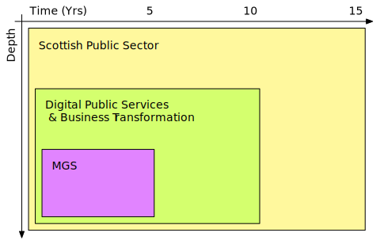
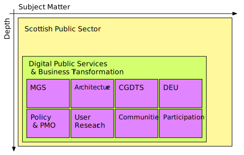

# Architecture Partitioning

## Purpose

Architecture partitions are used to simplify the development and management of an enterprise architecture.

It is impractical to present a definitive partitioning model for architecture. Each enterprise needs to adopt a partitioning model that reflects its own operating model.

This document discusses the classification criteria that are generally applied to architectures and describes how these have been used to partition the enterprise architecture for the Scottish public sector, into a set of architectures with manageable complexity, *from the perspective of the DPS&BT division of the Scottish Government*.

## Contents

<!--TOC max3-->

## Revision History

| Version | Issued     | Comments
| ---     | ---        | ---
| 0.1     | 01-12-2015 | Outline draft created for review by architecture team.

## Distribution List

| Role | RACI
| ---  | ---
| Head of Digital Architecture, DPS&BT | Accountable, Responsible
| Technical Architect, MGS             | Consulted
| Technical Solutions Lead, CGDTS      | Consulted
| ISO, DPS&BT                          | Informed
| Infrastructure Manager, DPS&BT       | Informed

## Review

|                    | |
| ---                | ---
| *Review frequency* | Every 6 months
| *Next review due*  | 01-06-2017

## Partitioning Charactertistics

This section summarises the characteristics that are typically used to partition archtectures.

### Architecture Partitioning

|       | |
| ---   | ---
| Depth | The level of detail within an architecture has a strong correlation to the stakeholder groups that will be interested in the architecture.  Typically less detailed architectures will be of interest to executive stakeholders. As architectures increase in detail, their relevance to implementation and operational personnel will also increase.

### Solution Partitioning

|     | |
| --- | ---
| Subject Matter | Solutions are naturally organized into groups to support operational management and control. Examples of solution partitions according to subject matter would include applications, departments, divisions, products, services, service centers, sites, etc.  Solution decomposition by subject matter is typically the fundamental technique for structuring both solutions and the architectures that represent them.
| Time | Solution lifecycles are typically organized around a timeline, which allows the impact of solution development, introduction, operation, and retirement to be managed against other business activity occurring in similar time periods.
| Maturity | The maturity and volatility of a solution will typically impact the speed of execution required for the solution lifecycle.  Additionally, volatility and maturity will shape investment priorities. Solutions existing in highly volatile environments may be better suited to rapid, agile development techniques.

## Identified Architecture Partitions

The below diagrams illustrate the DPS&BT architecture partitioning based on the characteristics described above.

*Partitioning: Depth vs. Time*

*Partitioning: Depth vs. Subject Matter*

The following sections provide further details regarding specific architecture partitions identified above.

### MGS (Capability Architecture)

#### Organization Structure

Team membership:

- The MGS team is delivery focused comprising technical specialists across a range of disciplines (software / test / infrastructure engineering, etc.) complemented by strong content design, user research and product management functions.
- The primary leadership for the MGS capability is through the programme director, providing project and programme management, and the technical architect, providing technical direction;
- These roles are supported by a Product Manager as well as a Head of Analytics & Performance.

Team reporting lines:

- Both the programme director and technical architect have direct reporting lines into the Deputy Director for DPS&BT, who is the SRO for the MGS programme;
- The technical architect also has a reporting line into the DPS&BT Head of Digital Architecture in order to provide coherence across the DPS&BT segment.

Governance of the architecture:

- Operational ownership of the MGS architecture rests with the MGS technical architect;
- Direct, operational governance of the architecture is applied via a technical design authority, which runs biweekly;
- Indirect, strategic governance of the architecture is applied via:
    - the Scottish Government Technical Design Board – the DPS&BT Head of Digital Architecture is a member of this board;
    - the ICT assurance element of the gateway review process, managed by the Office of the CIO.

#### Responsibilities

The following **subject matter areas** are covered by the MGS architecture:

- the design and build of the MGS content management platform;
- the build and operation of the mygov.scot informational website;
- content management and design for citizen and business facing content;
- performance management and analytics for citizen and business facing transactional services.

**Level of detail**: The MGS architecture will operated at a fine-grained level of architectural detail and, as such, is considered to be a capability architecture.

**Time periods**: All MGS architectural activities are undertaken as a programme of work. Programmes in scottish Government typically run from 1-4 years. Within the programme mid-level planning is undertaken every 100 days and fine grained planning every 2 weeks.

**Stakeholders**: The vision for the mygov.scot website is that it will act as a single access point for citizens and businesses from across Scotland to the public sector information they require. This necessitates a broader range of stakeholders than would be typical for a capability architecture. Key stakeholders include:

- Citizens and businesses of Scotland (the 'users');
- CTO/CIOs from across the Scottish public sector;
- Digital content managers and content designers from across the Scottish public sector;
- SG digital leadership.

#### Relationships between Architectures

This architecture capability forms an element of, and is fully contained by, the DPS&BT segment architecture. As such, online services delivered as a part of this capability should re-use assets and resources (e.g. architecture building blocks, solution building blocks, reference models, etc.) defined at the the segment level.

The MGS content platform has been re-used as a solution building block for the delivery of the gov.scot service. However, delivery of the gov.scot architecture is independent of MGS & owned by the Scottish Government digital comm's team. There is no formal relationship between the architectures.

An early version of the MGS visual design (including logo-type) was used as the branding for the myaccount sign-in and verification service. However, the myaccount service itself is owned by the Improvement Service. The myaccount architecture is owned and managed the Improvement Service and there is no formal relationship between the architectures. However, myaccount is the official Scottish solution for sign-in and verification and, therefore, if features such as citizen personalisation were added to the MGS informational site then integration of my account SHOULD be considered.

Compliance requirements:

- Online services delivered by this architecture capability MUST comply with the Digital First standard;
- Online services delivered by this architecture capability SHOULD comply with the Scottish Government High Level Operating Framework;
- Online services delivered by this architecture capability SHOULD comply with Scottish Government digital strategy and policy.

Standards defined:

- This capability does not define any standards.

## References

- [TOGAF 9.1, Ch 40: Architecture Partitioning](http://pubs.opengroup.org/architecture/togaf9-doc/arch/chap40.html)
