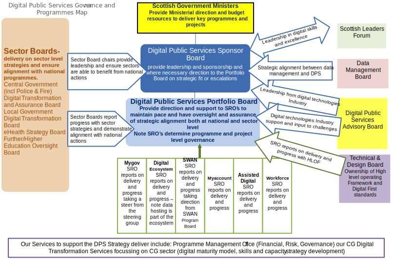

# Organisational Model

## Purpose

Architecture activity is not undertaken in isolation. For an architecture practice to be effective it must be sympathetic to the work that an organisation undertakes, the processes and tools established to do so, and the existing architecture maturity. In particular, the architecture framework must be proportionate to the scale and complexity of the work that is to be undertaken. This document describes the organisational context within which our architecture work is undertaken in order to provide a canvas against which the architecture practice can be tailored.

## Contents

<!--toc max3-->

## Scope of Organisations Impacted

The scope of this architecture activity is limited to our division. However, the architecture practice will influence and be influenced by each of the branches within the divsion to a greater or larger degree. Some branches require specific, full time input from our architecture practice with full time architects assigned. Currently:

- Mygov.scot;
- Central Government Digital Transformation Service (CGDTS);
- Digital Ecosystem Unit (DEU).

Our architecture practice will also actively engage with the broader architecture community, both within Scottish Government and the Scottish public sector as whole, through:

- membership of the Technical & Design Board (T&DB);
- contribution to the Office of the CIO (OCIO);
- etc.

The scope of impact of the architecture practice is illustrated in the following diagram. Blue indicates direct impact and yellow indicates indrect impact.

## Maturity assessment, gaps, and resolution approach

There is no maturity model for architecture formally agreed by our organisation. We acknowledge that selecting a preferred framework (e.g. [The US Department of Commerce's Architecture Capability Maturity Model (ACMM)](http://ocio.os.doc.gov/ITPolicyandPrograms/Enterprise_Architecture/PROD01_004935)), performing a baseline assessment of maturity, identifying a maturity target, plotting gaps and agreeing a resolution approach is a useful way to support continuous improvement of the practice. We plan to complete a baseline maturity assessment within the next six months.

### Maturity Assessment

*TBD*.

### Gaps

*TBD*.

### Resolution Approach

*TBD*.

### Related Work

#### Digital Maturity Model

As part of its digital strategy services, CGDTS has developed a digital maturity model (DMM) which consultants use to work with organisations to assess their start position in terms of understanding and adoption of digital technology, culture and processes.

Digital maturity modelling helps organisations:

- assess their digital capability against established standards;
- assesses their ability to respond to the needs of a digital customer base;
- decide where it wants to be and how to get to that point;
- go towards establishing a digital strategy prioritised roadmap for digital improvement.

The DMM has been developed around the four principles outlined in [Scotland's Digital Future: Delivery of Public Services](http://www.gov.scot/Publications/2013/02/4411) as well as industry best practice. The questionnaires within the DMM will allow for detailed analysis / review of the organisation’s current state digital maturity.

The output is a report which allows an organisation to better progress its digital efforts. The report output provides:

- a scoring mechanism which allows the organisation to measure progress on its digital journey;
- high level strengths, weaknesses, opportunities, threats (SWOT);
- key findings and other relevant information.

The DMM output when combined with user research and impact mapping analysis provides a powerful mechanism for an organisation to define its digital journey. The next step is the creation of a digital strategy which sets out the organisation's future journey, timelines, high level themes and enables it to create a roadmap for transformation.

## Roles and responsibilities for architecture team(s)

The following table describes the key stakeholders in our architecture practice.

| Role                         | RACI | Comments |
| -                            | -    | - |
| Deputy Director (DD) for Digital Public service & Business Transformation (DPS&BT) | Accountable | The DD for DPS&BT has overall responsibility for all activities within the division, including architecture practice. |
| Head of Digital Architecture (HoDA) | Responsible | The HoDA has day-to-day for leading the architecture practice as well as establishing and then improving our architecture framework. |
| DPS&BT Leadership Team       | Consulted   | Leadership team members have individual responsibility for delivering on behalf of the DPS&BT DD within their respective areas of responsibility. The architecture framework will (to a greater or lesser degree) have an influence on how they undertake these responsibilities.|
| Architects in our team | Responsible | Our architects will be expected to follow the tailored architecture framework as well as to contribute to the evolution of that framework and the broader practice so that it continues to be relevant to digital delivery.
| [T&DB](http://www.gov.scot/Topics/Economy/digital/digitalservices/dpsbtgovernance)| Consulted   | It is a responsibility of the T&DB to support the delivery of the Scottish Government's public sector ICT infrastructure agenda, and contribute to delivering the identified efficiencies, benefits and outcomes. If the establishment of our architecture practice is successful then many of the approaches, document and other knowledge accumulated can be made available to other parts of the Scottish public sector for re-use. The T&DB can also provide constructive challenge to our activities, acting as a critical friend in order to improve the quality of the work undertaken.
| [Chief Information Officer (CIO)](http://www.gov.scot/Topics/Economy/digital/CIO) | Consulted | Scottish Government CIO is responsible, under the umbrella of the Office of the CIO, for Programme Assurance and Standards across Digital Directorate, Scottish Government and the wider Central Government Sector. This includes ensuring that the organisation operates according to the principles embedded in ISO/IEC 38500:2008. It is essential that our architecture practice is an enabler for, rather than an impediment to this activity.
| [The Office of the CIO (OCIO)](http://www.gov.scot/Topics/Economy/digital/CIO)                         | Consulted | The OCIO manages and co-ordinates a range of activities onbehalf of the CIO in order to deliver on the above responsibilities.

## Related Management Frameworks

In the same way that architecture activities must be undertaken alongside a range of other delivery activities in order to achieve business change so must the selected architecure framework align with other organisational frameworks defined to ensure activities are undertaken effectively. This section lists existing frameworks established to support the operation of the organisation, as well as execution of change. Where appropriate the impact of framework alignment will also be considered.

###  Independent Assurance of Programmes and Projects

The Scottish Public Finance Manual sets out the conditions that must be followed in delivering major investment programme and projects and provides good practice for all other types of programmes and projects.

Regardless of the scale of their subject matter all Scottish Government programmes and projects must adhere to the Programme and Project Management Principles.

The Programme and Project Management Centre of Expertise (PPM-CoE) provides a focal point for programme and project management within the Scottish Government and:

- supports improvement of programme and project management capabilities;
- manages and supports the delivery of the independent programme and project assurance framework;
- encourages and supports the sharing of lessons learned from programme and project delivery.

In particular the PPM-CoE coordinates independent assurance activities for Scottish Government programmes and projects. Independent Assurance aims to increase the likelihood that change initiatives delivered by policy, programmes or projects achieve the intended results and outcomes.  It involves people who are not directly associated with the initiative or delivery area.  This brings a fresh perspective and constructive challenge for teams tasked with delivering in complex but strategically important environments.

Independent assurance gives Accountable Officers, Senior Responsible Owners and Ministers confidence in the delivery of major commitments.

Independent assurance is mandatory for certain categories of change initiatives and conditions are detailed in the Scottish Public Finance Manual.

[More details](http://www.gov.scot/Topics/Government/ProgrammeProjectDelivery).

The PPM-CoE has not yet updated guidance and assurance materials to reflect agile and adaptive approaches to project and programme delivery. In the interim architecture framework development should consider advice from HMG's Major Projects Authority: ([Major Projects Authority assurance and approvals for agile delivery of digital services](https://www.gov.uk/government/uploads/system/uploads/attachment_data/file/444588/MPA_Guidance_Assuring_Agile_Projects.pdf)) as the basis for framework alignment.

### ICT Assurance Framework

The [ICT Assurance Framework](http://www.gov.scot/Topics/Economy/digital/CIO/Assurance/AssuranceFramework) applies to [Central Government Organisations](http://www.gov.scot/Topics/Economy/digital/CIO/Assurance/CGOrganisations) in Scotland under the jurisdiction of Scottish Ministers or responsible to the Scottish Parliament.

The framework supports Senior Responsible Owners (SROs) and Accountable Officers (AOs) in assuring the delivery of projects and programmes involving substantial investment in ICT.  It allows SROs to identify and access the support required to achieve successful delivery of their projects and programmes.

The framework assists the [Central Government](http://www.gov.scot/Topics/Economy/digital/digitalservices/centralgovernment) sector in ensuring that proposed investments are aligned with [Scotland's Digital Future: Delivery of Public Services](http://www.gov.scot/Publications/2013/02/4411); including identification of opportunities for collaboration and shared services and provide an overview of the investment in, and management of, ICT of central government programmes and projects and any actions needed to ensure successful delivery.

[More details](http://www.gov.scot/Topics/Economy/digital/CIO/Assurance).

### Digital First Assessment

The Digital First Service Standard describes the minimum standard required when delivering a citizen-facing, online service, that will be provided via [mygov.scot](https://www.mygov.scot). The document is based upon GDS' "Digital by Default" standard. A full framework to underpin how an organisation should meet the standard has not yet been established. Where necessary organisations should refer to advice in [GDS' Service Manual](https://www.gov.uk/service-manual).

Activity is underway to establish an assessment process that will be used to confirm that organisations meet the standard. Further information will be released in due course.

[More details on the Digital First Service Standard](http://resources.mygov.scot/standards/digital-first/).

### Digital Measurement and Benefits Framework

Our common approach to measurements and benefits has been developed in partnership with DPS Strategy Assurance Board members and their sectoral boards and focuses on the key measurements and benefits to deliver on the national priority action and strategic ambitions.

The Measurement and Benefits Framework is based on the balanced scorecard approach and contains 16 measures which provide comprehensive coverage of the main benefits areas arising from the activity set out in the "[Scotland's Digital Future – Delivery of Public Services Strategy](http://www.scotland.gov.uk/Publications/2012/09/6272)".

- Are we meeting the needs of our citizens and businesses?
- Are we achieving financial and carbon savings?
- Are we enabling joined-up public services?
- Are we developing our workforce to deliver our digital ambitions?

A review of this framework is currently underway, led by the Policy and Programme Management team within the Digital Public Services & Business Transformation division. The outcome of this review is expected later in 2016 with an updated framework to follow.

[More details](http://www.gov.scot/Topics/Economy/digital/digitalservices/MandBframework).

### Procurement Framework

Where archtitecture activity is undertaken and delivery of the identified solution requires acquisition of software, hardware or specialists services then one or more procurements may be required. The Scottish Government's Scottish Procurement & Commercial Directorate (SPCD) leads procurement activity for the Scottish Central Government Family.

The [Procurement Policy Handbook](http://www.gov.scot/Publications/2008/12/23151017/0) sets out the fundamental rules, behaviours and standards applicable to public procurement activity in Scotland. SPCD have also created the "[Procurement Journey](https://www.procurementjourney.scot)", which is intended to support all levels of procurement activities and to help manage the expectations of stakeholders, customers and suppliers alike and facilitates best practice and consistency across the Scottish public sector.

Any architecture framework established must be designed such that it can accomodate the above procurement framework when acquiring solutions or solution components.

### High Level Operating Framework

The [High Level Operating Framework](http://www.gov.scot/Topics/Economy/digital/digitalservices/HLOF) has been prepared in response to a commitment to develop a framework which supports the strategic goals of Scotland’s digital future. This framework supports transformation through providing a set of architecture and design principles; promoting and supporting the use of commonly agreed standards and specifications; and providing an information assurance approach. The collaboration and integration that this supports, with a focus on reuse before buy, will eliminate duplication and avoidable spend.

Version 1 of the Framework identified a set of guiding principles and proposed a common architecture approach to the development and delivery of digital public services. Version 2 takes account of progress and developments around the national level work programmes for Data Management, Scottish Public Sector Portal (mygov.scot), Scottish Wide Area Network (SWAN), Data Hosting and Data Centre Strategy , Secure and Easy-sign for citizens (myaccount) as well as incorporating feedback from the Scottish public sector as to how the Framework has influenced and may continue to influence the management of change in their organisations.

The Framework provides guidance to the public sector, and the ICT Industry that works with the public sector, on how to design, develop and deliver future digital public services. The intended audience for this document is all Chief Executives, Chief Information Officers, Chief Technology Officers and Service Leads. The organisations within the scope of this Framework are the Scottish Government, its agencies and non-departmental bodies accountable to Ministers, including Scottish Police and Fire services; NHS Scotland; local government; and universities and colleges.

### Independent Audit

#### Internal Audit

The Scottish Government includes an [Internal Audit Division](http://www.gov.scot/Topics/Government/Finance/InternalAudit). Internal audit provides an independent, objective assurance and consulting activity designed to add value and improve the organisation's operations. It provides an appraisal of the organisation's internal control system and takes action needed to provide Accountable Officers with a continuing assurance that the organisation's risk management, control and governance arrangements are adequate and effective. It helps the organisation accomplish its objectives by bringing a systematic, disciplined approach to evaluate and improve the effectiveness of risk management, control and governance processes. The operation and conduct of internal audit aims to comply with [Public Sector Internal Audit Standards](http://www.cipfa.org/-/media/Files/Publications/Standards/Public%20Sector%20Internal%20Audit%20Standards.pdf).

#### Audit Scotland

The Auditor General is appointed by the Crown, on the recommendation of the Scottish Parliament. The independent post was created to help ensure that public money is spent properly, efficiently and effectively. [Audit Scotland](http://www.audit-scotland.gov.uk/) provides the Auditor General and the Accounts Commission with the services they need. Audit Scotland audits about 200 organisations including the 74 central government bodies (Scottish Government, non-departmental public bodies, Police Scotland, Scottish Fire and Rescue Service and others).

Audit Scotland staff (and firms of auditors appointed by them) carry out the audits. They check whether organisations:

- Manage their money to the highest standards;
- Get the best possible value for public money.

Audit activities include the consideration of ICT delivery undertaken by the Scottish public sector. Audit Scotland have published two major reports related to ICT in recent years:

- [Managing ICT contracts: an audit of three public sector programmes (2012)](http://www.audit-scotland.gov.uk/report/managing-ict-contracts-an-audit-of-three-public-sector-programmes);
- [Managing ICT contracts in central government: an update (2015)](http://www.audit-scotland.gov.uk/report/managing-ict-contracts-in-central-government-an-update).

#### Audit and Architecture

While these audit organisations do not publish a formal framework there is an expectation that any architecture framework for the Scottish public sector includes effective and proportionate governance activity, which is clearly situated within the broader context of public sector and ICT governance through clear terms of reference. In addition, as with all public sector activities, there is an expectation that the architecture framework embodies the values of [The Civil Service Code](https://www.gov.uk/government/publications/civil-service-code/the-civil-service-code).

### Service Management Framework

At this time there is no organisation-wide standard for framework management. However, the ICT Assurance Framework reviewers guidance does consider a number of the processes typically associated with service management.

### Information Security

The security of information stored and processed by digital public services is crucial. A range frameworks have been established to support successful delivery in this regard.

At a UK level the [security policy framework](https://www.gov.uk/government/publications/security-policy-framework) describes the standards, best-practice guidelines and approaches that are required to protect UK government assets (people, information and infrastructure). It focuses on the outcomes that are required to achieve a proportionate and risk-managed approach to security that enables government business to function effectively, safely and securely.

This framework is underpinned by the new Government [security classification policy](https://www.gov.uk/government/publications/government-security-classifications) that describes how HM Government classifies information assets to ensure they are appropriately protected. It applies to all information that government collects, stores, processes, generates or shares to deliver services and conduct business.

Information security practice for the Scottish central govenrment family is lead by the Cyber Defence and Information Security (CDIS) branch of the Digital directorate. CDIS own the Scottish Government [IT security policy](http://intranet/InExec/SEAndMe/IT/StrategiesPolicies/SecurityPolicy) (intranet) that, approved by the Scottish Government Information Systems Security Committee (ISEC), sets out the framework within which the Scottish Government will develop, implement, manage and review its IT security. The Policy exists within and develops upon the Scottish Government Information Security Policy. CDIS also provides additional guidance related to information security that describes the Scottish approach to realising HMG's security policy framework, including:

- risk management;
- personnel security;
- physical security;
- handling of security breaches.

## Existing processes that support execution

Architecture activities must be correctly integrated with, and complementary to, the other prevailing business and delivery processes that exist within a business. This section lists existing processes established to support the operation of the organisation, as well as execution of change, that will have an influence on how our architecture practice will function. The linked documents describe our current understanding of how our architecure practice will be integrated with each process.

<!--
    — Current methods for architecture description
    — Current project management frameworks and methods
    — Current systems management frameworks and methods
    — Current project portfolio management processes and methods
    — Current application portfolio management processes and methods
    — Current technology portfolio management processes and methods
    — Current information portfolio management processes and methods
    — Current systems design and development frameworks and methods
-->

- [Risk management](risk-management.md);
- [Stakeholder management](stakeholder-management.md);
- Benefits management;
- Standards endorsement;
- Change management.

## Existing Governance Arrangements

This section describes the existing arrangements that have been established to govern delivery against "[Scotland's Digital Future – Delivery of Public Services Strategy](http://www.scotland.gov.uk/Publications/2012/09/6272)" as well as the various reporting lines. Further details, including links to full terms of reference, are available on the [governance page on gov.scot](http://www.gov.scot/Topics/Economy/digital/digitalservices/dpsbtgovernance).

The purposes of each of the major boards are as follows.

### Digital Public Services Sponsor Board Remit

> To promote and sponsor the delivery of the vision and commitments of “Scotland’s Digital Future: Delivery of Public Services’’ and the developing National Public Services Digital Ecosystem to keep that strategy under review; to ensure alignment of national level and sector delivery and developing thematic strategies; and to ensure effective communication of objectives, delivery and approaches to delivery.

### Digital Public Services Portfolio Board Remit

> To ensure delivery of the national projects and programmes that together make the greatest contribution to the digital ecosystem and digital transformation, and to support sectors to develop their initiatives in a way which is aligned with and, where appropriate, contributes to the development of, the overall ecosystem, in order to realise  the aims of our Digital Public Services Strategy.

### Digital Public Services Advisory Board Mission

> We will manage our work as an Advisory Board to facilitate engagement between the Scottish public sector and the ICT industry in Scotland. 
We will do this to contribute to the work of the Digital Public Services Sponsor Board, which ensures effective communication of the objectives, and the delivery of, the commitments made in the strategy Scotland’s Digital Future: Delivery of Public Services. 
We will do this by acting in an independent capacity with a broad focus on Scottish-wide issues, free from commercial propriety.

### Technical & Design Board Remit

>To provide technical and strategic input from the public sector technical community into the delivery of the recommendations set out in:
>
>- The McClelland Review of ICT Infrastructure in the Public Sector in Scotland, and in;
>- Scotland's Digital Future Delivery of Public Services.
>
>The Technical and Design Board reports into the Digital Public Services National Level Actions Programme Board.

## Baseline Architecture Landscape

The broader Scottish public sector has been delivering digital public services, as well as ICT systems more generally, for many years. As such, digital architecture activities, both enterprse architecture and solution architecture, have formed a part of the delivery process. However, with enhanced focus on digital transformation and, in particular, channel shift, (as a result of the [Scotland's Digital Future – Delivery of Public Services Strategy](http://www.scotland.gov.uk/Publications/2012/09/6272)) well functioning architecture capabilities have become more important to Scottish public sector organisations.

This is directly evident in the current version of the [High Level Operating Framework](http://www.gov.scot/Publications/2015/07/2901), which includes two principles that focus directly on the enterprise architecture capabilities of the Scottish public sector and Scottish public sector organisations:

- **OFP-SW1.2**: To increase the capability of the public sector in the discipline of Enterprise Architecture in order to support an overall increase in the capability of ICT professionals at all levels in the public sector;
- **OFP-CV7**: An Enterprise Architecture approach to ICT planning will be adopted by all Scottish Public Sector organisations.

Enagagement of branches including the Office of CIO (OCIO), the Central Government Digital Transformation Service (CGDTS) and the Digital Ecosystem Unit (DEU) with the broader Scottish public sector means that we are continuing to improve our understanding of both their architecture capabilities and maturity as well as their progress in terms of evolving their digital architectures.

Organisations including:

- [Transport Scotland](http://www.transport.gov.scot);
- [Disclosure Scotland](http://www.disclosurescotland.co.uk);
- [National Records of Scotland](http://www.nrscotland.gov.uk);
- [Registers of Scotland](https://www.ros.gov.uk/);
- and [NHS Scotland eHealth](http://www.ehealth.nhs.scot);

actively include enterprise and solution architecture activities as a part of their overall delivery approach. In particular, NHS Scotland eHealth have published a numer of their key deliverables on their website. For example:

- [NHS Scotland eHealth Architecture Vision](http://www.ehealth.nhs.scot/wp-content/uploads/sites/7/documents/ehealth-architecture-vision-august-08.pdf)
- [NHS Scotland eHealth Architecture Principles](http://www.ehealth.nhs.scot/wp-content/uploads/sites/7/documents/standard-architecture-principles1.pdf).

However, at this stage we are not aware of any clear, consistent and comprehensive documentation of the baseline digital architecture landscape for the Scottish public sector. Furthermore, there is no agreed taxonomy, modelling language or document templates that might form the basis for such a description. This is not a criticism, merely an observation that such a description does not currently exist. If we treat the Scottish public sector as the "enterprise" then it is clear that digital delivery is an extremely complex undertaking spanning the activities of around 140 distinct organisations. In most cases these organisations have their own budgets and a high degree of autonomy to deliver digital public services and other ICT systems, using the approach that best fits their specific business context.

Coordination of the delivery of these organisations from the perspsective of digital architecture is through the national performance framework generally, and then through the suite of national digital policy, strategy, standards and frameworks that define how digital delivery as a whole contributes to the Scottish Government's strategic objectives and national outcomes. It is a focus of the Technical & Design Board both to coordinate and to progress our enterprise architecture, specifically through:

- Supporting the delivery of the Scottish Government's public sector ICT infrastructure agenda, and contribute to delivering the identified efficiencies, benefits and outcomes;
- Supporting the development of the technical and design requirements and standards at national and sectoral levels, to ensure that where national solutions are developed these can be implemented for all areas of the public sector.

The pan-sectoral scope of the T&DB means that it is especially well placed to enhance the current understanding of the Scottish public sector baseline architecture landscape in the future. This will be complemented by the "to be created" national Technical and Design Authority and the OCIO.

## Implications of Organisational Model

On the basis of the preceding sections we can set out a number of actions and themes related to the establishment of a successful architecture practice:

- In lieu of a baseline architecture landscape for the enterprise (the Scottish public sector) we should clearly document the architecture landscape from a divisional perspective;
- Our architecture framework must be designed such that it is effective within the existing governance and delivery arrangements for the Scottish central government and beyond. In particular we must be cognisant of the collaborative approach that is taken in the Scottish public sector, which includes a high degree of distributed authority. As such, our model should focus on an "influence rather than direct" paradigm;
- The architecture practice and underlying framework must accomodate a range of activities both in terms of the nature of work and the duration. In particular:
    - we will engage in both solution architecture and enterprise architecture;
    - activities may range from several days to several years in length;
- Effective collaboration with the OCIO will be very important;
- We should consider how we can enhance operational understanding of the Scottish public sector baseline architecture landscape as a whole;
- We will establish a maturity model for digital architecture, baseline our current maturity against the model, set a maturity target and agree a set of actions to achieve the target maturity;
- We will look to embrace the Scottish Approach in our practice. In particular, we will aim to publish the deliverables and artefacts that we create early and often. This should engender a collaborative and open approach to our work both so that we can engage other architects from across the public sector as well as to provide examples of architecture practice that may be of use to others;
- We should aim to establish an architecture community of practice that allows architects from across the Scottish public sector to share ideas and discuss best practice.
